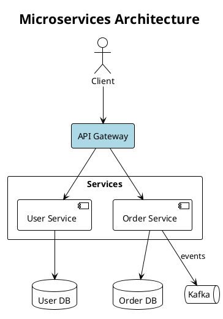
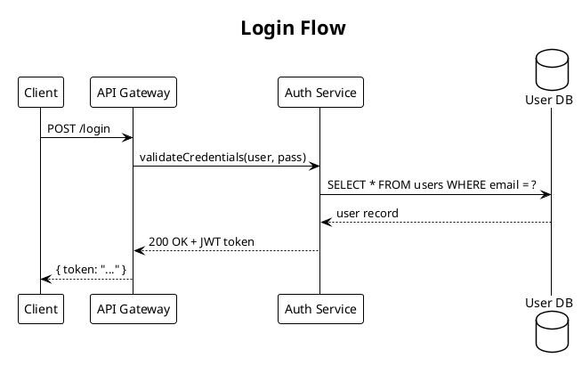
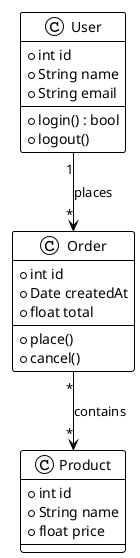
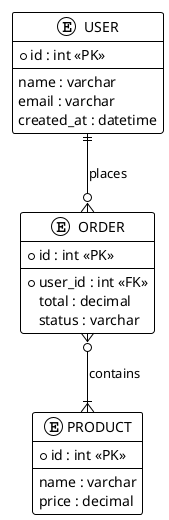
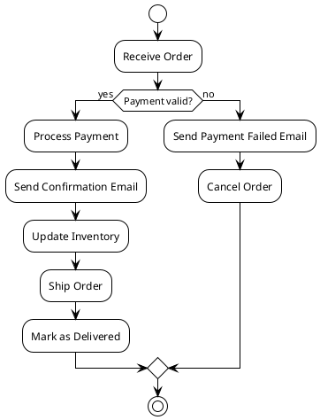
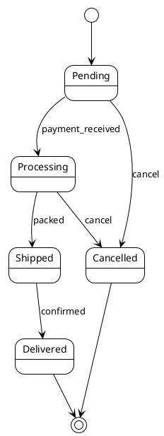

# PlantUML Diagram Skill

## Overview

Generate `.puml` PlantUML diagram files and export to PNG/SVG using **Kroki** — a cloud rendering API that requires no local installation beyond `curl`.

**Format:** `.puml` (PlantUML text)
**Renderer:** Kroki API (`https://kroki.io`) — just `curl`, no Java needed
**Output:** PNG, SVG
**Diagram types:** sequence, component, class, ER, activity, use case, state, C4, and more

## When to Use

**Explicit triggers:**
- "plantuml diagram", "sequence diagram", "class diagram", "component diagram"
- "UML", "activity diagram", "use case diagram", "state machine"
- "visualize", "draw", "diagram", "flowchart", "architecture chart"

**Proactive triggers:**
- Explaining a system with 3+ interacting components
- Describing API flows, authentication sequences, message passing
- Showing class hierarchies, database schemas, or ER models
- Illustrating state machines or lifecycle flows

## Prerequisites

**Option A: Kroki API (recommended — no install)**
```bash
# Just needs curl (pre-installed on macOS/Linux/Windows Git Bash)
curl --version
```

**Option B: Local Kroki via Docker (for offline use)**
```bash
docker run -d -p 8000:8000 yuzutech/kroki
# Then replace https://kroki.io with http://localhost:8000 in commands
```

**Option C: Local PlantUML jar (traditional)**
```bash
# Requires Java + Graphviz
brew install graphviz   # macOS
sudo apt install graphviz  # Ubuntu
# Download plantuml.jar from https://plantuml.com/download
java -jar plantuml.jar diagram.puml
```

## Workflow

### Step 1: Check Dependencies
```bash
curl --version
```
curl is available on all modern systems. If missing, install via package manager.

### Step 2: Pick Diagram Type
Choose the most appropriate PlantUML diagram type (see reference below).

### Step 3: Generate .puml File
Write the PlantUML source file with `@startuml` / `@enduml` markers.

### Step 4: Export via Kroki
```bash
# PNG (recommended)
curl -s -X POST https://kroki.io/plantuml/png \
  -H "Content-Type: text/plain" \
  --data-binary "@diagram.puml" \
  -o diagram.png

# SVG
curl -s -X POST https://kroki.io/plantuml/svg \
  -H "Content-Type: text/plain" \
  --data-binary "@diagram.puml" \
  -o diagram.svg
```

### Step 5: Report to User
Tell the user:
- Path to the `.puml` source file
- Path to the exported PNG/SVG
- Brief description of what was generated

---

## Diagram Types

| Type | Keyword | Use for |
|------|---------|---------|
| Sequence | `@startuml` + sequence syntax | API calls, protocol flows, message passing |
| Component | `@startuml` + components | service architecture, module dependencies |
| Class | `@startuml` + class syntax | OOP models, data structures |
| ER / Entity | `@startuml` + entity syntax | database schemas |
| Activity | `@startuml` + activity syntax | workflows, business processes |
| Use Case | `@startuml` + actor/usecase | system requirements, user stories |
| State | `@startuml` + state syntax | state machines, lifecycle |
| C4 Context | `@startuml` + C4 includes | high-level system context maps |
| Mind Map | `@startmindmap` | topic breakdowns, concept maps |
| Gantt | `@startgantt` | project timelines, schedules |

---

## Syntax Reference

### Component / Architecture Diagram



**Shape types:**
- `actor "Name" as id` — stick figure (user, external actor)
- `component "Name" as id` — component box with [brackets]
- `rectangle "Name" as id` — plain rectangle (for groups/layers)
- `database "Name" as id` — cylinder (database)
- `queue "Name" as id` — queue symbol
- `cloud "Name" as id` — cloud shape (external services)
- `node "Name" as id` — server/node box
- `frame "Name" as id` — frame grouping
- `package "Name" { }` — package grouping

**Arrows:**
- `A --> B` — solid arrow
- `A -> B` — thin arrow
- `A ..> B` — dashed arrow
- `A --> B : label` — labeled arrow
- `A <--> B` — bidirectional

**Colors:**
- `#LightBlue`, `#LightGreen`, `#LightYellow`, `#Pink`, `#Violet`
- `#AED6F1` (blue), `#A9DFBF` (green), `#FAD7A0` (orange), `#F1948A` (red)
- `#D7BDE2` (purple), `#F9E79F` (yellow), `#D3D3D3` (grey)

---

### Sequence Diagram



**Arrow types:**
- `A -> B` — synchronous call
- `A --> B` — return / dashed
- `A ->> B` — async message
- `A -[#red]-> B` — colored arrow
- `activate A` / `deactivate A` — show activation box

---

### Class Diagram



**Relationships:**
- `A --> B` — association
- `A --|> B` — inheritance
- `A ..|> B` — implements interface
- `A *-- B` — composition
- `A o-- B` — aggregation
- `A "1" --> "*" B : label` — with multiplicities

---

### ER Diagram



---

### Activity / Flowchart



---

### State Diagram



---

## Export Commands

```bash
# PNG via Kroki API (recommended)
curl -s -X POST https://kroki.io/plantuml/png \
  -H "Content-Type: text/plain" \
  --data-binary "@diagram.puml" \
  -o diagram.png

# SVG via Kroki API
curl -s -X POST https://kroki.io/plantuml/svg \
  -H "Content-Type: text/plain" \
  --data-binary "@diagram.puml" \
  -o diagram.svg

# Via local Kroki Docker (offline)
curl -s -X POST http://localhost:8000/plantuml/png \
  -H "Content-Type: text/plain" \
  --data-binary "@diagram.puml" \
  -o diagram.png

# Via local PlantUML jar (if installed)
java -jar plantuml.jar diagram.puml
# Output: diagram.png in same directory
```

---

## Themes

```plantuml
!theme plain       ← clean, minimal (recommended)
!theme cerulean    ← blue-tinted
!theme blueprint   ← dark blue background
!theme aws-orange  ← AWS style
!theme vibrant     ← vivid colors
```

Or use `skinparam` for custom styling:
```plantuml
skinparam backgroundColor #FAFAFA
skinparam componentBorderColor #555555
skinparam ArrowColor #333333
skinparam FontName Arial
```

---

## Common Mistakes

| Mistake | Fix |
|---------|-----|
| `curl` POST returns HTML error page | Check network; try `curl -v` to see error details |
| Kroki returns 400 Bad Request | Validate PlantUML syntax at https://www.plantuml.com/plantuml/uml/ |
| Arrow direction unexpected | Use `-->` for downward/right; explicitly use `-up->`, `-down->`, `-left->`, `-right->` |
| Diagram too large/crowded | Split into multiple diagrams or use `package`/`rectangle` grouping |
| Missing `@startuml` / `@enduml` | Always wrap diagram in these markers |
| Special chars in labels | Wrap in quotes: `"Label: value"` |
| C4 includes not found via Kroki | Use Kroki's `c4plantuml` diagram type instead of `plantuml` for C4 diagrams |
| Component overlap | Use `together { }` or explicit layout hints (`top to bottom direction`) |
| Sequence participants out of order | Declare `participant` explicitly at top in desired left-to-right order |
